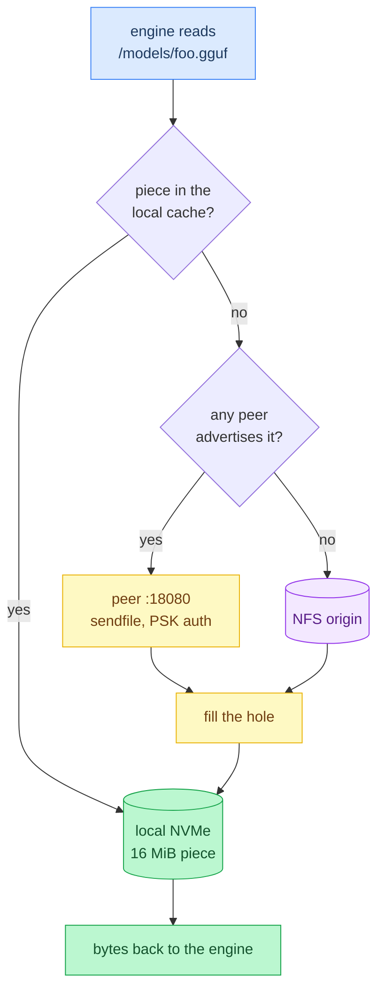
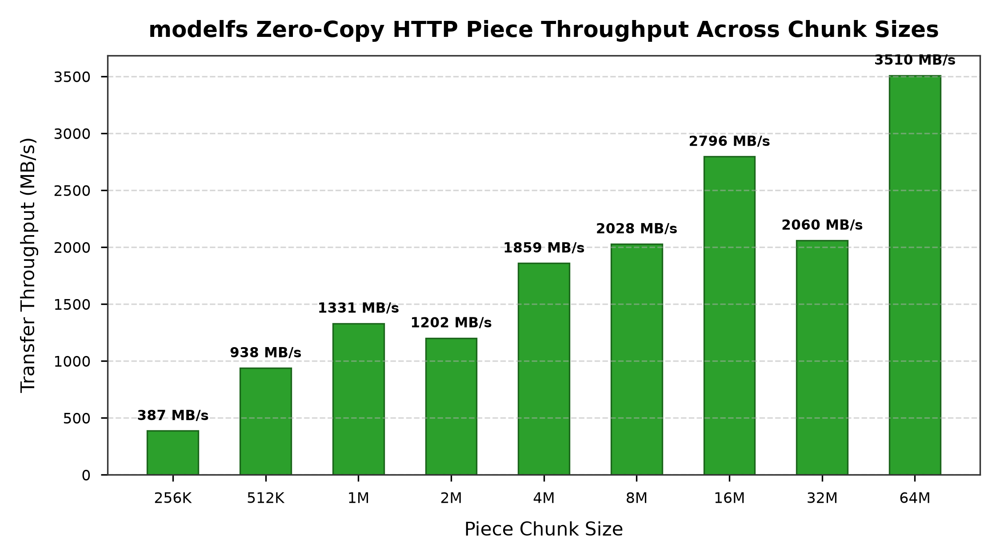

# ModelFS

[](https://github.com/maci0/modelfs/actions/workflows/ci.yml)

A POSIX `/models` mount for LLM weights. One Zig binary per node: FUSE via `libfuse3`, a local NVMe piece cache, and peer-to-peer piece transfers that stream zero-copy through Linux `sendfile`. Engines (`llama.cpp`, `vLLM`, `SGLang`) just open files.

| Path | Role |
| :--- | :--- |
| `/net/<nas>/models` | NFS origin, the read/write authority. Required |
| `/models` | FUSE mount point on the GPU nodes |
| `/var/cache/modelfs` | local NVMe piece cache, 16 MiB pieces |
| `:18080` | peer HTTP protocol, PSK bearer auth |



Reads: **local piece → cluster peer (`sendfile`) → origin**.
Writes: **origin first → then fill the local cache**.

A read that misses blocks until that one piece is filled from a single source. There is no background whole-file striping: it OOMed the unified memory on the target hardware.

Status: works on the cluster it was written for (two DGX Spark nodes plus a ZFS/NFS NAS). Linux only.

Releases: `v0.1.0` is the first tag ([CHANGELOG.md](CHANGELOG.md)). Security issues go through private vulnerability reporting: [SECURITY.md](SECURITY.md).

---

## Requirements

* Linux with `/dev/fuse` and **libfuse3** (headers to build: `libfuse3-dev` / `fuse3-devel`)
* **Zig 0.16.0** or newer
* A shared POSIX directory every node can see (NFS or anything else) to act as the origin

## Build

```bash
zig build -Doptimize=ReleaseFast          # ./zig-out/bin/modelfs
zig build test --summary all              # unit tests
```

Non-default libfuse3 locations, e.g. when cross-compiling: the vendored arm64 tree ships as `.deb` files only (`root/` and `lib/` are gitignored), so extract it first with the one extractor script CI's cross-aarch64 job runs too ([.deps/fuse3-arm64/README.md](.deps/fuse3-arm64/README.md) holds the provenance; the script falls back to `ar` plus `zstd` or `tar --zstd` on hosts without dpkg):

```bash
./scripts/extract_fuse3_arm64.sh
./scripts/cross_aarch64.sh                # ReleaseFast aarch64; same recipe CI runs
```

## Quickstart

```bash
# once per node
sudo mkdir -p /models /var/cache/modelfs
sudo chown "$(id -u):$(id -g)" /models /var/cache/modelfs
umask 077; openssl rand -hex 32 | sudo tee /etc/modelfs.psk   # same file on every node

# same command on every node (id defaults to the hostname)
modelfs mount /models --origin /net/192.168.0.100/models
```

`mount` stays in the foreground (drop it in a systemd `Type=simple` unit; `--detach` to background it). Then:

```bash
modelfs status                                    # liveness, peers, and lifetime counters (reads, fills by source, errors)
modelfs peers --origin /net/192.168.0.100/models  # live cluster leases
modelfs pin gguf/foo.gguf                         # keep a file out of the cull
modelfs unpin gguf/foo.gguf
```

Nodes find each other through lease files the origin holds at `.cluster/<id>.json`, so no broker and no multicast; `--seed HOST[:PORT]` bootstraps the very first node. Every node needs the same PSK. `modelfs help` documents every flag, including `--cache`, `--id`, `--listen`, `--advertise`, `--piece`, `--kernel-cache`, and the `--brun`/`--bcull`/`--bstop` cull watermarks. `MODELFS_ORIGIN`, `MODELFS_CACHE`, `MODELFS_PSK`, and `MODELFS_ID` set the same values from the environment, `MODELFS_PSK_VALUE` carries an inline secret that no flag accepts (argv is world-readable through `/proc`), and `MODELFS_LOG` sets the log ceiling (`err`, `warn`, `info`, `debug`); an explicit flag wins and an empty environment value counts as unset.

Only the GPU nodes run `modelfs`. Workstations mount the same export over plain NFS ([docs/operations.md](docs/operations.md)).

---

## Benchmarks

Measured with nine `modelfs` instances on **one host over TCP loopback**, not across real NICs, so these bound the software rather than the network. Full report and plots: [docs/benchmarks.md](docs/benchmarks.md).

| Benchmark | Result |
| :--- | :--- |
| Peak `sendfile` throughput (64 MiB pieces) | 3.5 GB/s |
| `/ping` sweep across 9 instances | 1.1 ms total |



The piece-size sweep is why the default piece is 16 MiB: past it the gain is small, and every miss costs the reader a whole piece before the read returns.

## Tests

```bash
zig build test -Dtest-filter=relOk        # only tests whose names contain this substring
zig build test --watch                    # rebuild and re-run on change
zig build fmt                             # apply zig fmt
./scripts/check.sh                        # fmt, unit tests, shellcheck, ruff, mypy
./scripts/ci.sh                           # every CI job: check, aarch64 cross, repro
./scripts/repro_check.sh                  # build twice, require byte-identical output
./scripts/run_e2e_tests.sh                # CLI and peer protocol end to end
./scripts/run_cluster_e2e_9nodes.sh       # 9-instance block exchange
./scripts/test_fault_tolerance.sh         # peer loss and lease expiry
./scripts/dr_restore_drill.sh             # monthly restore drill, on the NAS (docs/recovery.md)
./scripts/test_dr_restore_drill.sh        # restore drill against stub zfs (also in check.sh)
python3 scripts/run_benchmarks_and_plots.py  # live benchmarks -> .scratch/benchmarks/
```

The benchmark script measures the machine it runs on: it writes to gitignored
`.scratch/benchmarks/` unless you pass `--update-docs`, which is how
[docs/benchmarks.md](docs/benchmarks.md) and its figures are regenerated from
representative hardware.

Python tooling is pinned in [requirements-dev.txt](requirements-dev.txt); install the hash-verified lock with `uv venv .venv && uv pip install --require-hashes -r requirements-dev.lock.txt`.

## Source layout

| Module | Role |
| :--- | :--- |
| `main.zig` | CLI, command dispatch, mount wiring |
| `fuse_fs.zig` | libfuse handlers, read hydration, write-through |
| `store.zig` | local piece cache, persisted bitfields |
| `piece.zig` | piece arithmetic and the bitfield itself |
| `peer.zig` | peer HTTP server (`/ping`, `/have`, `/data`) and fetch client |
| `proto.zig` | wire helpers: sizes, ranges, URL codec, bearer auth |
| `discover.zig` | origin-side lease files: publish, refresh, sweep |
| `cull.zig` | cache eviction watermarks |
| `sys.zig` | syscall wrappers |
| `c.zig` | the single door to libfuse3/libc |
| `fuzzcorpus.zig` | shared seed-corpus framing for the `std.testing.fuzz` harnesses |
| `root.zig` | test aggregator: pulls every module's tests into the test binary |

`@cImport` is deprecated in Zig 0.16, so C declarations are translated once from `src/c.h` by `build.zig`; `c.zig` re-exports that module and every other module goes through it. `build.zig.zon` declares no package dependencies: the binary links only `libfuse3`, libc, and pthread.

## Documentation

[docs/](docs/) has the index. Shortest path in:

* [docs/architecture.md](docs/architecture.md): how it actually behaves: cache layers, discovery, path scoring, auth, culling, write races.
* [docs/operations.md](docs/operations.md): the ZFS/NFS/FS-Cache setup underneath, and Hugging Face downloads.
* [docs/recovery.md](docs/recovery.md): what survives which disaster: backups, per-case restore steps, RPO/RTO, restore drills.
* [docs/benchmarks.md](docs/benchmarks.md): numbers, with the caveats that qualify them.
* [docs/audits.md](docs/audits.md): review findings and their fixes; [docs/review-guides/](docs/review-guides/) holds the checklists they came from.
* [docs/design.md](docs/design.md): the original sketch, kept for history. It marks what never shipped.

## License

GPL-3.0-or-later. See [LICENSE](LICENSE).
