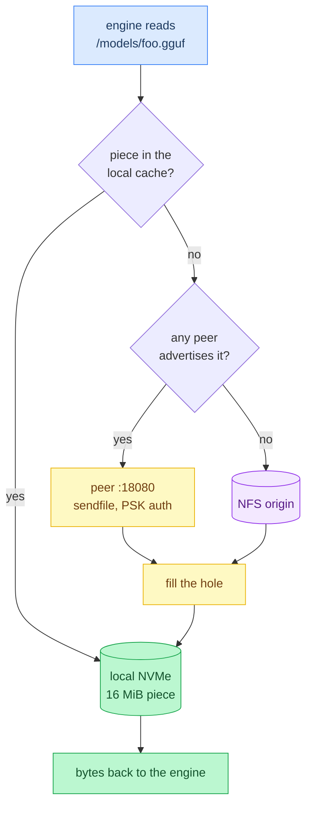
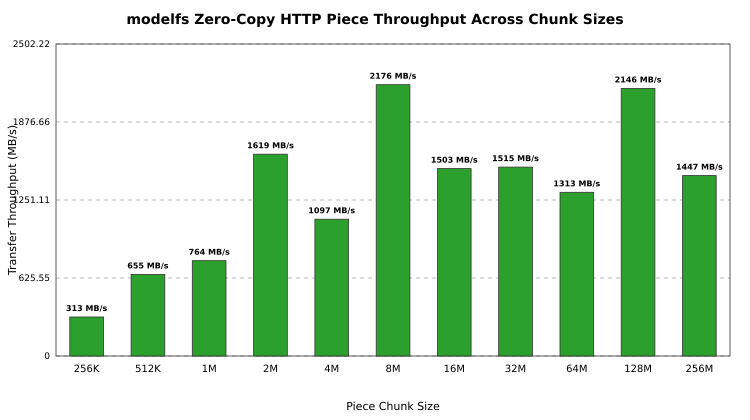

# ModelFS

[](https://github.com/maci0/modelfs/actions/workflows/ci.yml)

A POSIX `/models` mount for LLM weights. One Zig binary per node: FUSE via `libfuse3`, a local NVMe piece cache, and peer-to-peer piece transfers that stream zero-copy through Linux `sendfile`. Engines (`llama.cpp`, `vLLM`, `SGLang`) just open files.

| Path | Role |
| :--- | :--- |
| `/net/<nas>/models` | NFS origin, the read/write authority. Required |
| `/models` | FUSE mount point on the GPU nodes |
| `/var/cache/modelfs` | local NVMe piece cache, 16 MiB pieces |
| `:18080` | peer HTTP protocol, PSK bearer auth |



Reads: **local piece → cluster peer (`sendfile`) → origin**.
Writes: **origin first → then fill the local cache**.

A read that misses blocks until that one piece is filled from a single source. If the local cache cannot land the fill (full or broken cache disk), that one read is served from the origin and the piece stays unmarked. There is no background whole-file striping: it OOMed the unified memory on the target hardware.

Status: works on the cluster it was written for (two DGX Spark nodes plus a ZFS/NFS NAS). Linux only.
Current release `v0.8.0`, which is what a build from this tree prints.
Upgrade notes per release, including the breaking ones, are in [CHANGELOG.md](CHANGELOG.md).
Security reports: [SECURITY.md](SECURITY.md).

---

## Requirements

* Linux (x86_64 or aarch64) with `/dev/fuse` and **libfuse3** (headers to build: `libfuse3-dev` / `fuse3-devel`). Sparks deploy `aarch64-linux-gnu.2.39` (Ubuntu 24.04 glibc); CI tests the x86_64 build on ubuntu-24.04 and cross-compiles that aarch64 ABI. GitHub releases attach static single-file binaries for both (`x86_64-linux-musl`, `aarch64-linux-musl`: libfuse3 compiled in, nothing to install, checksums published); building from source uses the distro libfuse3.
* **Zig 0.16.0** or newer
* A shared POSIX directory every node can see (NFS or anything else) to act as the origin

## Build

```bash
zig build -Doptimize=ReleaseFast          # ./zig-out/bin/modelfs
./scripts/cross_aarch64.sh                # aarch64 ReleaseFast, the recipe CI runs
```

The aarch64 build needs an arm64 libfuse3, which ships here as `.deb` files only.
`cross_aarch64.sh` extracts them into `.scratch/fuse3-arm64/`, hash-checked against
[.deps/fuse3-arm64/SHA256SUMS](.deps/fuse3-arm64/SHA256SUMS) (provenance:
[.deps/fuse3-arm64/README.md](.deps/fuse3-arm64/README.md)); without `dpkg` it falls
back to `ar` plus `zstd` or `tar --zstd`. For any other libfuse3 location, point
`-Dfuse-include=` / `-Dfuse-lib=` at it.

## Quickstart

```bash
# once per node
sudo mkdir -p /models /var/cache/modelfs
sudo chown "$(id -u):$(id -g)" /models /var/cache/modelfs
# generate once; copy the same file to every node (do not regenerate per host)
umask 077; openssl rand -hex 32 | sudo tee /etc/modelfs.psk

# same command on every node (id defaults to the short hostname)
modelfs mount /models --origin /net/192.168.0.100/models
```

`mount` stays in the foreground (drop it in a systemd `Type=simple` unit; `--detach` to background it).

Nodes find each other through lease files the origin holds at `.cluster/<id>.json`, so no
broker and no multicast. Every node needs the same PSK. `--seed HOST[:PORT]` bootstraps
while `.cluster` has no live lease.

## Commands

```bash
modelfs status                                    # liveness, peers, origin_down, lifetime counters
modelfs peers --origin /net/192.168.0.100/models  # cluster leases, each marked live or expired
modelfs pin gguf/foo.gguf                         # keep a file out of the cull
modelfs unpin gguf/foo.gguf
modelfs verify gguf/foo.gguf --origin ...         # rehash cached pieces, clear mismatches
modelfs dupes gguf/a.gguf gguf/b.gguf --origin .. # how much do two files share?
modelfs dupes --all --origin ...                  # whole-store duplicate scan
modelfs pull unsloth/Qwen3-8B-GGUF --origin ...   # download a Hugging Face revision onto the origin
modelfs update                                    # swap the running binary without unmounting
```

`modelfs update` replaces a live mount's process image: the kernel connection and the peer
port stay, so an fd an engine already holds keeps reading across the swap. It finds the
daemon the same way `status` does, through `--cache`.

`modelfs pull` downloads a Hugging Face revision onto the origin, where every node's mount
then serves it. Files already there at the listed size are skipped, so a rerun resumes.

`modelfs help` documents every flag. The ones that come up most:

| Flag | Default | What it does |
| :--- | :--- | :--- |
| `--origin PATH` | required | the shared directory that owns the bytes |
| `--cache PATH` | `/var/cache/modelfs` | local piece cache |
| `--id NAME` | short hostname | node id in the lease |
| `--listen [IP:]PORT` | `18080` | peer port; the IP is ignored, binding is always all interfaces |
| `--advertise IP[:PORT],...` | every non-loopback IPv4 | replaces the auto-detected list, not additive |
| `--seed HOST[:PORT]` | none | peer to try while `.cluster` has no live lease; repeatable |
| `--piece SIZE` | `16M` | piece size |
| `--direct-io` / `--kernel-cache` | `--direct-io` | the page cache is off by default because it is UMA RAM shared with the GPU; turning it on permits mmap and can OOM |
| `--allow-other` | off | the only way a uid other than the mounter reaches the mount; needs `user_allow_other` |
| `--detach` / `-f` | `-f` | background after mount, or stay in the foreground |
| `--brun` / `--bcull` / `--bstop` | `10` / `7` / `3` | cull watermarks, percent free |
| `--log LEVEL` | `info` | `err`, `warn`, `info`, `debug` |

Secrets never take a flag, because argv is world-readable through `/proc`:

| Secret | Sources, in order |
| :--- | :--- |
| cluster PSK | `--psk FILE` (default `/etc/modelfs.psk`, mode 0600), `MODELFS_PSK`, or `MODELFS_PSK_VALUE` for the inline form |
| Hugging Face token | `HF_TOKEN`, then `$HF_HOME/token`, then `~/.cache/huggingface/token` |

`MODELFS_ORIGIN`, `MODELFS_CACHE`, `MODELFS_PSK`, `MODELFS_ID`, and `MODELFS_LOG` set the same
values as their flags; an explicit flag wins, values are whitespace-trimmed, and an empty one
counts as unset. Any other `MODELFS_*` name is refused as a typo. Full rules, including the
`MODELFS_PSK_VALUE` exclusivity and the address gates, are in
[docs/architecture.md](docs/architecture.md).

Only the GPU nodes run `modelfs`. Workstations mount the same export over plain NFS
([docs/operations.md](docs/operations.md)).

---

## Benchmarks

Measured with nine `modelfs` instances on **one host over TCP loopback**, not across real NICs, so these bound the software rather than the network. Full report and plots: [docs/benchmarks.md](docs/benchmarks.md).

| Benchmark | Result |
| :--- | :--- |
| Peak `sendfile` throughput (64 MiB pieces) | 3.5 GB/s |
| `/ping` sweep across 9 instances | 1.1 ms total |



The piece-size sweep is why the default piece is 16 MiB: past it the gain is small, and every miss costs the reader a whole piece before the read returns.

## Tests

```bash
zig build test --summary all              # unit tests
./scripts/check.sh                        # the blocking gate, exactly what CI runs
./scripts/ci.sh                           # that gate plus the aarch64 and reproducibility jobs
```

Setup from a fresh clone, the edit-test loop, the end-to-end suites, and what each
script does: [CONTRIBUTING.md](CONTRIBUTING.md). `./scripts/check.sh --help` lists every
contributor command, and each script answers `--help` itself.

Python tooling is pinned in [requirements-dev.txt](requirements-dev.txt) and installed from
the hash-verified lock. [sbom.cdx.json](sbom.cdx.json) is the CycloneDX inventory of that
lock, the vendored libfuse3 debs, the SHA-pinned GitHub Actions, and the Zig version pin;
`python3 scripts/sbom.py --check` holds it to them in the gate.

## Documentation

Start at [docs/architecture.md](docs/architecture.md) for how it actually behaves.
[docs/](docs/) has the full index, including operations, disaster recovery, benchmarks,
the threat model, and the original design sketch.

Source is a flat `src/*.zig`; the module map is in
[docs/architecture.md](docs/architecture.md#modules). `build.zig.zon` declares no package
dependencies: the binary links only `libfuse3`, libc, and pthread.

## Contributing

Setup, the `./scripts/check.sh` gate (the same command CI runs), the
edit-test loop, and PR expectations: [CONTRIBUTING.md](CONTRIBUTING.md).

## License

GPL-3.0-or-later. See [LICENSE](LICENSE).
