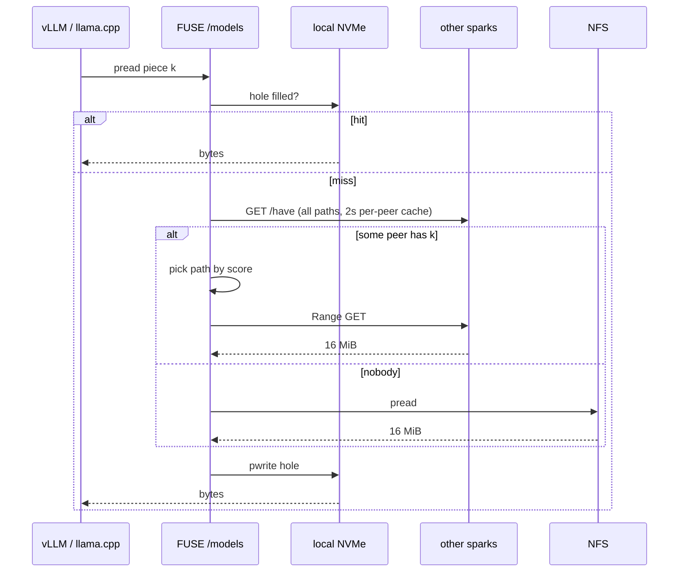

# Three-layer block cache

| Field | Value |
|---|---|
| Status | Shipped-behavior reference; kept current against `src/` |
| Date | 2026-08-23 |
| Design history | [design.md](design.md): original architecture, goals G1-G10 with ship status, key decisions and what did not ship |

Shipped in `modelfs` (Zig, libfuse3). A process on a spark only opens `/models/...`.



One piece, one source. Misses block the read until that hole is filled. No full-file background stripe (that OOMed UMA).

---

## Layout (this cluster)

| Path | What |
|---|---|
| `192.168.0.100:/export/models` | ZFS NFS export |
| `/net/192.168.0.100/models` | NFS origin on sparks, **no `fsc`** |
| `/models` | FUSE (sparks). Empty local dir, uid 1000 |
| `/var/cache/modelfs` | pieces (`data/`, `meta/*.pieces`, `pin/`) |
| `:18080` | peer HTTP, bound on all interfaces; non-loopback IPv4 advertised in the lease |

Desktop: mount NFS at `/models` with `fsc` as in [operations.md](operations.md). Do not run `modelfs` there.

`stat` / `readdir` / `mkdir` / `unlink` / `rename` → origin. `write` / `create` / `truncate` → origin, then this node's cache. `.cluster` is hidden from FUSE `readdir`.

Origin is **required**. It can be any POSIX dir both nodes see, not only NFS. Two-node with no shared store is not implemented.

---

## Run

Needs `fuse3`. Same PSK on every spark. Id is the short hostname. Advertise is every non-loopback IPv4 except 169.254.

```bash
# once
sudo mkdir -p /models /var/cache/modelfs
sudo chown 1000:1000 /models /net/192.168.0.100/models /var/cache/modelfs
# optional: umask 077; openssl rand -hex 32 | sudo tee /etc/modelfs.psk

# spark1 and spark2, same command (hostname + NICs differ)
~/bin/modelfs mount /models --origin /net/192.168.0.100/models \
  --psk /etc/modelfs.psk
```

Foreground (systemd `Type=simple`). Per-event logs are failure-only: unauthorized peer requests, failed piece fetches (with `ip:port` and error), origin/cache errors, cull-watermark trouble. Steady state is summarized instead: one `tick:` line per discovery interval while any counter moved (reads, writes, fills by source, fill errors, MiB, culled, http401/5xx), so an idle node logs nothing.

```
modelfs status
modelfs peers --origin /net/192.168.0.100/models
modelfs pin gguf/foo.gguf
modelfs unpin gguf/foo.gguf
```

`status` prints the daemon's `status.json` from the cache dir; a missing file means the mount is not running, and so does a leftover naming an exited pid (the crash case: the artifact is only served while its writer process still exists). It carries liveness (`id`, `pid`, `uptime_s`), topology (`peers`, `piece`, `inflight` HTTP handlers), and lifetime counters (`stats`: reads/writes with errors, piece fills by source (peer vs origin) with byte totals, fill failures per tier, pieces culled, rejected auths, 5xx replies). `peers` lists every lease in `origin/.cluster` with its addresses and whether it is still live.

Env: `MODELFS_ORIGIN` `MODELFS_CACHE` `MODELFS_PSK` `MODELFS_ID`.

`--id`, `--advertise IP:PORT`, `--cache`, `--listen` override defaults. `--seed HOST[:PORT]` bootstraps peers while `origin/.cluster` has no live lease. `--kernel-cache` turns kernel page cache back on (UMA can OOM). `--brun` / `--bcull` / `--bstop` are cull watermarks.

Build:

```bash
# this desktop (x86_64)
zig build -Doptimize=ReleaseFast

# sparks (aarch64, Ubuntu 24.04 fuse 3.14)
zig build -Dtarget=aarch64-linux-gnu.2.39 -Doptimize=ReleaseFast \
  -Dfuse-include=.../fuse3 -Dfuse-lib=.../libfuse3
```

---

## Discovery

Node identity is hostname, not an IP. Each spark writes a lease on the **origin** (not through FUSE):

```
<origin>/.cluster/<id>.json
```

```json
{
  "id": "spark1",
  "until": 1710000060,
  "addrs": [
    {"ip": "10.0.1.1", "port": 18080, "mbps": 0},
    {"ip": "192.168.0.211", "port": 18080, "mbps": 0}
  ]
}
```

Refresh every 10s, `until` = now+30s. Drop expired. Skip your own `id`. No PSK in the JSON. Every node also sweeps the directory each tick: lease files whose mtime is older than 300 s and abandoned `<id>.json.tmp` staging files from crashed publishes are unlinked, except this node's own lease. Origin root must be writable by uid 1000 so `.cluster` can be created.

---

## Path score

A path is `(peer id, ip, port)`.

```
score = ewma_goodput_bps / (1 + hops) / (1 + inflight)
```

- **goodput**: EWMA of Range replies (bytes / wall time), in B/s. Prior until the first probe is 100 MB/s; a lease `mbps` (Mbit/s) is converted to B/s instead when nonzero.
- **hops**: 0 if same IPv4 /24 as a local addr, else 1.
- **inflight**: pieces already assigned to that path.

On miss: among paths whose `/have` bit is set, max score. GET fails: next path, then NFS. Never two sources for one piece.

Probe answers are cached per (path, file) for 2 s (`Catalog.have_ttl_ms`), so a sequential fill of one large model sends `/have` once per peer per TTL window instead of once per peer per piece. Only hits are cached: a stale bitmap can at worst route a fetch to a peer that no longer has the piece, which the next-path fallback already handles; failed probes are never cached, so a down peer is retried on the next piece.

---

## Auth and HTTP

Same secret on every spark. `--psk-value` or `/etc/modelfs.psk` mode 0600.

```
GET /ping
GET /have?path=<url-encoded rel>
GET /data?path=...
Range: bytes=start-end
Authorization: Bearer <psk>
```

`/have` replies carry `X-Piece-Size: <n>`, the piece grid the bitmap's bits are indexed against; a fetcher running a different `--piece` treats that peer's answer as no-answer instead of routing fills by bits that cover different byte ranges (a fleet should still run one piece size; mixed grids degrade to origin traffic, never to wrong data). Peers older than this header read as unknown and are assumed aligned. The bitmap body itself stays raw bits.

401 if missing/wrong. Listen `0.0.0.0:18080`; `--listen [IP:]PORT` picks the port, binding stays on all interfaces. At most 16 HTTP handlers.

---

## Cache cull

Like cachefilesd, on **percent free** of the filesystem that holds `/var/cache/modelfs` (here the 3.6T root):

| flag | default | meaning |
|---|---|---|
| `--brun` | 10 | stop culling |
| `--bcull` | 7 | start culling |
| `--bstop` | 3 | cull harder |

Culling punches 16 MiB holes (`FALLOC_FL_PUNCH_HOLE`), clears that bit, leaves the sparse file. LRU by last read. Skip `pin`, files read in the last 10s, and entries with a peer transfer in flight (punching mid-send would ship hole zeros the fetching peer cannot tell from real data). Next read hydrates that piece again.

`pin` is a marker under `pin/`. Nothing else is deleted as a whole file.

---

## Writes and races

Write is NFS 1:1, then a copy into this node's cache. If NFS fails, the write fails. No write-back buffer.

Two writers on the same path: last `pwrite` on NFS wins. No cluster lock. The other node's cache can keep stale pieces until cull or size change. Ingest on one node; everyone else reads. Second copy of a model: new path.

UMA: kernel page cache is off (`direct_io`). mmap of FUSE files will fail; engines fall back to `read`. `--kernel-cache` if you need mmap and the file fits in RAM.

---

## What did not ship

- Origin-less two-node (no shared dir)
- Content-addressed dedup / blake3 chunks
- Full-file background stripe
- cachefilesd stacked on FUSE (FUSE is not an FS-Cache client)
