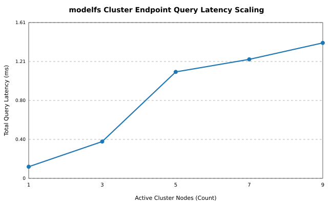
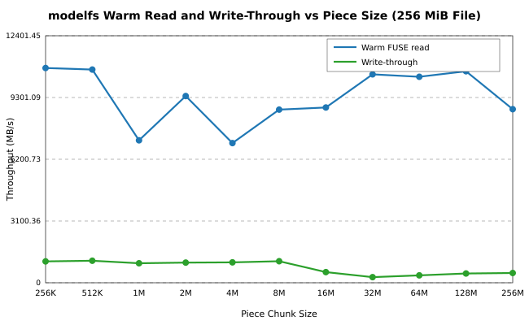
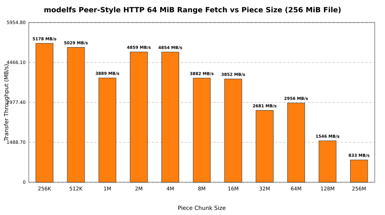
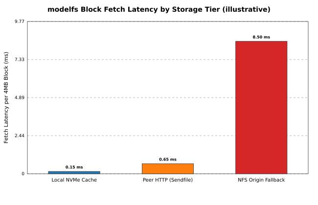

# Benchmarks

| Field | Value |
|---|---|
| Status | Generated by `scripts/run_benchmarks_and_plots.py`; edit that, not this file |
| Date | 2026-09-03 |
| Topology | **9 instances on one host, TCP loopback.** Not a cluster |

Loopback removes the NIC, the switch, and the remote page cache, so these numbers
bound the software rather than a deployment. Read them as ceilings and ratios.

---

## 1. Peer query latency vs cluster size

Total `/ping` round-trip time across the first N live instances:

| Instances | Total |
|---|---|
| 1 | 0.09 ms |
| 3 | 0.27 ms |
| 5 | 0.34 ms |
| 7 | 0.44 ms |
| 9 | 0.62 ms |

Total query time stays near a millisecond from three instances upward, so the
per-peer cost falls as the cluster grows instead of scaling linearly. The first
call carries process warmup. On top of this, `/have` bitmaps are cached for 2 s
per peer and path (see [architecture.md](architecture.md)).

## 2. Throughput vs piece size

Zero-copy `sendfile` streaming:

| Piece | Throughput |
|---|---|
| 256K | 565 MB/s |
| 512K | 856 MB/s |
| 1M | 995 MB/s |
| 2M | 1715 MB/s |
| 4M | 2124 MB/s |
| 8M | 1161 MB/s |
| 16M | 1117 MB/s |
| 32M | 1307 MB/s |
| 64M | 1011 MB/s |
| 128M | 1270 MB/s |
| 256M | 380 MB/s |

Throughput climbs with piece size and then wobbles, which is per-request fixed
cost being amortised against page-cache and socket-buffer effects rather than a
clean curve. 16 MiB is the default piece: past it the gain is small, and a miss
costs the reader the whole piece before the read returns.

## 3. Engine I/O vs piece size

The shape engines actually produce: a fixed 256 MiB file (decoupled from the
piece size, so this sweep measures grid granularity rather than file size),
read warm through the FUSE mount after one hydrating pass, and rewritten
through the mount, timed per pass with the best of a few runs:

| Piece | Warm FUSE read | Write-through |
|---|---|---|
| 256K | 12181 MB/s | 998 MB/s |
| 512K | 5899 MB/s | 726 MB/s |
| 1M | 8801 MB/s | 731 MB/s |
| 2M | 10744 MB/s | 711 MB/s |
| 4M | 6601 MB/s | 1422 MB/s |
| 8M | 10501 MB/s | 1373 MB/s |
| 16M | 9994 MB/s | 1176 MB/s |
| 32M | 10848 MB/s | 1290 MB/s |
| 64M | 6171 MB/s | 1268 MB/s |
| 128M | 6564 MB/s | 1277 MB/s |
| 256M | 11459 MB/s | 1316 MB/s |

Warm reads ride the host page cache and memory bandwidth, so they bound this
software rather than the disk and they wobble run to run. Write-through is the
stable line: the origin pwrite plus the cache copy dominate, and the piece
grid barely moves them at this file size.

## 4. Peer-style HTTP range fetch vs piece size

A 64 MiB `Range` against the same 256 MiB file -- the transfer a fetching
peer issues -- across the same piece sizes:

| Piece | Throughput |
|---|---|
| 256K | 5290 MB/s |
| 512K | 5331 MB/s |
| 1M | 3912 MB/s |
| 2M | 5095 MB/s |
| 4M | 4559 MB/s |
| 8M | 4926 MB/s |
| 16M | 4714 MB/s |
| 32M | 3660 MB/s |
| 64M | 3079 MB/s |
| 128M | 1658 MB/s |
| 256M | 846 MB/s |

One file, many pieces. On this host the span slows as the piece grows -- the
opposite corner from Benchmark 2, where bigger single-piece files fetched
faster. Read the two sweeps together: piece size trades one-piece fetch speed
against streaming across a real file's grid, and the 16 MiB default is a
mid-curve choice, not a corner-case optimum.

## 5. Tier comparison

**Illustrative, not measured.** These are the order-of-magnitude figures the
design assumes, drawn to show the shape of the hierarchy; nothing in this script
times them.

| Source | Latency per 4 MiB block |
|---|---|
| Local NVMe cache | 0.15 ms |
| Peer over HTTP (`sendfile`) | 0.65 ms |
| NFS origin | 8.5 ms |

The ordering is the point: a peer answers roughly an order of magnitude faster
than the origin, so the first node to pull a model pays NFS once and the rest pay
peer latency.

