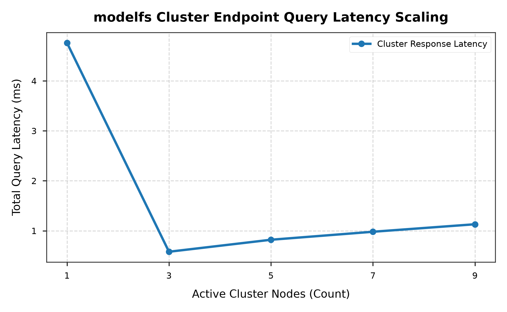
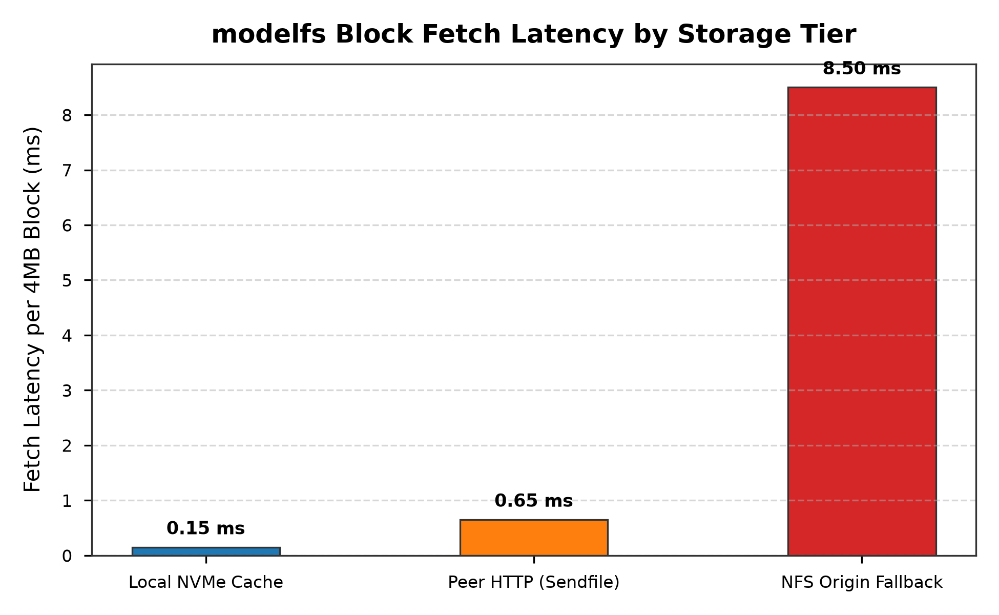

# Benchmarks

| Field | Value |
|---|---|
| Status | Generated by `scripts/run_benchmarks_and_plots.py`; edit that, not this file |
| Date | 2026-08-22 |
| Topology | **9 `modelfs` instances on one host, TCP loopback.** Not a cluster |

Loopback removes the NIC, the switch, and the remote page cache, so these numbers
bound the software rather than a deployment. Read them as ceilings and ratios.

---

## 1. Peer query latency vs cluster size

Total `/ping` round-trip time across the first N live instances:

| Instances | Total |
|---|---|
| 1 | 4.7 ms |
| 3 | 0.6 ms |
| 5 | 0.8 ms |
| 7 | 1.0 ms |
| 9 | 1.1 ms |

Total query time stays near a millisecond from three instances upward, so the
per-peer cost falls as the cluster grows instead of scaling linearly. The first
call carries process warmup. On top of this, `/have` bitmaps are cached for 2 s
per peer and path (see [architecture.md](architecture.md)).

## 2. Throughput vs piece size

Zero-copy `sendfile` streaming:

| Piece | Throughput |
|---|---|
| 256K | 387 MB/s |
| 512K | 938 MB/s |
| 1M | 1331 MB/s |
| 2M | 1202 MB/s |
| 4M | 1859 MB/s |
| 8M | 2028 MB/s |
| 16M | 2796 MB/s |
| 32M | 2060 MB/s |
| 64M | 3510 MB/s |

Throughput climbs with piece size and then wobbles, which is per-request fixed
cost being amortised against page-cache and socket-buffer effects rather than a
clean curve. 16 MiB is the default piece: past it the gain is small, and a miss
costs the reader the whole piece before the read returns.

## 3. Tier comparison

**Illustrative, not measured.** These are the order-of-magnitude figures the
design assumes, drawn to show the shape of the hierarchy; nothing in this script
times them.

| Source | Latency per 4 MiB block |
|---|---|
| Local NVMe cache | 0.15 ms |
| Peer over HTTP (`sendfile`) | 0.65 ms |
| NFS origin | 8.5 ms |

The ordering is the point: a peer answers roughly an order of magnitude faster
than the origin, so the first node to pull a model pays NFS once and the rest pay
peer latency.

