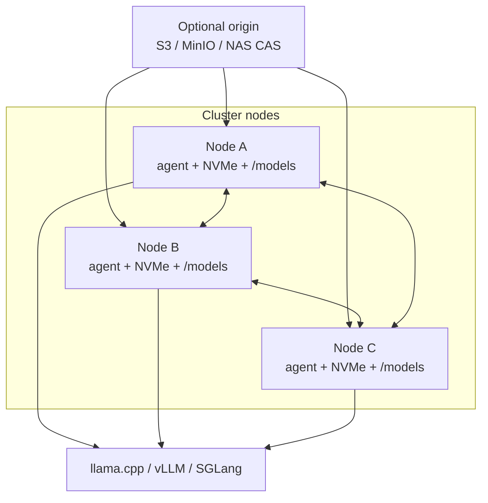
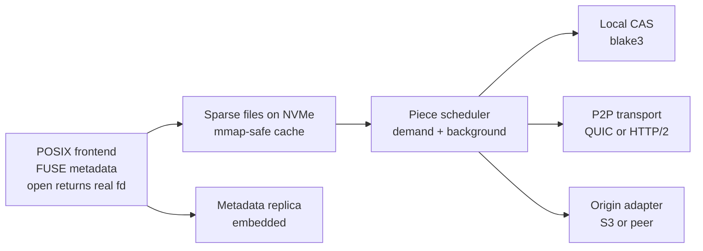
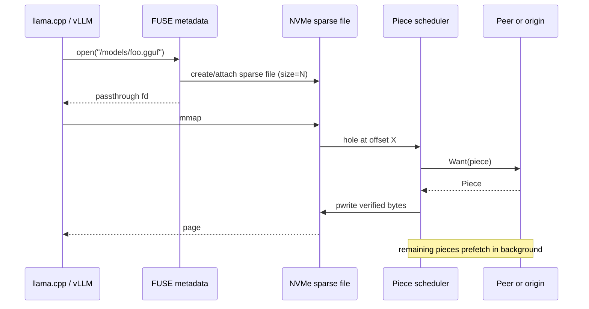
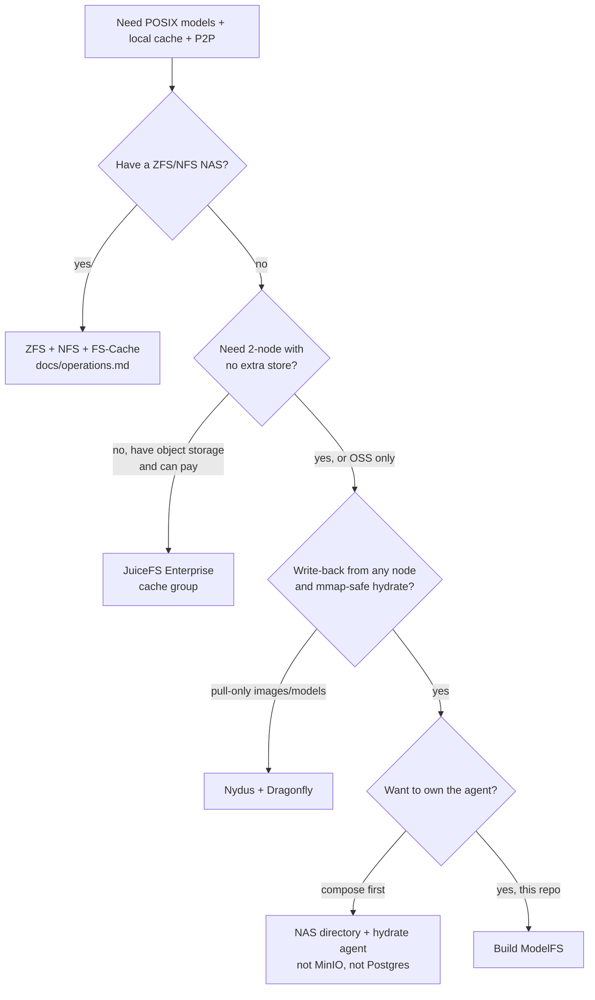

# ModelFS Design

| Field | Value |
|---|---|
| Status | Historical design. Goals (section 2.1) and decisions (section 13) carry ship status. Shipped behavior is [architecture.md](architecture.md) |
| Date | 2026-08-30 (goals/decisions/security rows and overview/targets/path notes re-verified against `src/`) |
| Audience | Implementation |

Original architecture notes. Several items here did not ship: origin-less two-node, CAS/blake3 chunks, S3, mmap-hydrate passthrough. The origin became **required** (any POSIX dir both nodes see), and the mount defaults to `direct_io`, so mmap fails without `--kernel-cache`: this reverses rule 6 in section 4.8 (rationale: UMA OOM, see architecture.md). What runs on the sparks is a FUSE 16 MiB piece cache in front of NFS. The implementation is Zig, not Go; peers speak plain HTTP (`GET /ping`, `/have`, `/data`, `/stage`) rather than Have/Want/Piece frames, and membership lives in `.cluster/<id>.json` lease files on the origin instead of an embedded metadata store.

ModelFS is a POSIX mount for LLM weights. Nodes see a normal directory. llama.cpp, vLLM, and SGLang open files. Bytes come from a local NVMe cache, from peers over a piece protocol, or from a network origin.

This is not a general-purpose distributed filesystem. Model files are huge, written rarely, and almost immutable. The sketch was a content-addressed blob store with a POSIX facade, a local cache, and datacenter P2P (G9 did not ship: the cache is path-keyed pieces, not CAS).

---

## 1. Overview

Original object model (namespace, manifests, content-addressed chunks). G9 did not ship; the diagram's optional S3 origin did not ship. Shipped topology is [architecture.md](architecture.md).

Three kinds of data, three consistencies:

| Layer | Contents | Typical size | Consistency |
|---|---|---|---|
| Namespace | directory tree, path to manifest | megabytes | replicated, write-rare |
| Manifest | ordered chunk hashes and lengths | kilobytes to megabytes per model | immutable once published |
| Chunks | content-addressed bytes | 64 KiB to 1 MiB | immutable, trivial to P2P |

Files are reconstruction recipes. Bytes live in the chunk store. Dedup is a consequence of addressing by hash.

Transfer units are not the same as dedup units:

- **Chunks** (64 KiB to 1 MiB, content-defined): dedup and integrity.
- **Pieces** (4 MiB to 16 MiB, concatenated chunks): what the swarm moves.

Mount is immediately usable because the namespace is tiny. This sketch assumed `ls /models` and `stat` are local after catalog sync, and that the 140 GiB payload would hydrate in the background and on demand and, once on NVMe, leave the agent out of the I/O path so mmap went native. What shipped: `stat` / `readdir` hit the origin (no local catalog; `mf_getattr` / `mf_readdir` in src/fuse_fs.zig); on-demand per piece only (a miss blocks until that one piece fills, no background stripe); `direct_io` by default, so FUSE mmap fails unless `--kernel-cache` is set (see architecture.md).



---

## 2. Goals and non-goals

### 2.1 Goals

Status is against the shipped code and [architecture.md](architecture.md) (2026-08-27).

| ID | Requirement | Status |
|---|---|---|
| G1 | Store model files on optional network storage (origin). | Superseded: origin is required, a POSIX dir, not S3. |
| G2 | Mount the same tree on every cluster node as a POSIX directory. | Shipped. |
| G3 | Each node that uses a file caches its bytes locally ("cache everything" of the working set). | Partial: pieces cache locally on read; no full-file prefetch. |
| G4 | Nodes exchange missing pieces with each other, torrent-style, in the background. | Partial: peers serve miss pieces on demand; no background swarm. |
| G5 | Mount is immediately usable: names and sizes exist before bytes arrive. | Shipped (origin `stat`/`readdir`; no local catalog). |
| G6 | Optional pin: pinned chunks are never LRU-evicted. | Shipped (path-level pin marker; chunk-level pin was G9 and did not ship). |
| G7 | Ingest on any node (download, `cp`, `modelfs pull`). Replicate back to origin. | Partial: writes are write-through to origin; no `modelfs pull`. |
| G8 | Two-node mode with no extra store. Replication factor 2. No Redis, no etcd required. | Not shipped (origin required); "no Redis, no etcd" still holds. |
| G9 | Content-addressed dedup across files and nodes. | Not shipped. |
| G10 | llama.cpp, vLLM, SGLang consume a path. No engine plugins. | Shipped. |

### 2.2 Non-goals

- General-purpose POSIX: databases, append-heavy logs, byte-range coherence on a live 70B file, `flock` as a cluster lock.
- Dedup across quantizations (Q4 vs Q8 vs safetensors of the same net). Those files do not share bytes.
- Replacing GPU memory loaders, tensorizer, or run:ai model streamer. Those can sit on top. They are not required.
- Public-internet BitTorrent (trackers, choking, NAT traversal).
- Cross-datacenter WAN as the primary path. Origin may be remote; the swarm is LAN.
- Windows / macOS as v1. Linux FUSE + NVMe first.
- Training sample-data random read at RDMA rates (DeepSeek 3FS territory).

---

## 3. Why not a distributed filesystem

Ceph, Lustre, BeeGFS, and 3FS are shared-storage systems. They solve "many writers, coherent namespace, disks as a pool." Model serving needs the opposite:

- Almost no writers.
- Every GPU node wants a **local** copy of the models it runs.
- First open must not wait for a 140 GiB copy from NAS.
- `mmap` must become a native file after hydrate, not a forever-FUSE path.
- Two hobby boxes should work with no metadata cluster.

3FS in particular turns cache off and uses direct I/O, because its workload is training sample scans. That is the wrong default here.

JuiceFS, Nydus, Dragonfly, and CVMFS are closer. Section 6 maps them onto these requirements. None of them hit G3+G4+G7+G8+G10 together without a custom agent. That agent is ModelFS.

---

## 4. Original proposal

It did not ship as written; goal status is section 2.1, decisions are section 13, and current behavior is [architecture.md](architecture.md).

### 4.1 Cache policy: replicate-on-read

This is not a JuiceFS Enterprise cache group. A cache group uses consistent hashing: a piece may live on some other node forever, and every read can be a network hop.

ModelFS policy: a node that **uses** a file ends up with those chunks on **that** node's disk. P2P only fills misses. Later reads never leave the box.

"Cache everything" is a warmup policy on top of that:

- Default: cache what you touch. On `open`, prefetch the rest of that file in the background.
- `modelfs pin --prefetch` / cluster pin: pull the whole tree onto a node.
- If the working set fits on each NVMe, origin goes quiet after the first swarm.

### 4.2 Node internals

One agent per machine. One mount. Nothing linked into the inference process.



### 4.3 Object model

```
file = {
  path, size, mtime, mode,
  digest,                          # blake3 of the whole file
  chunks: [{hash, offset, len}]
}

chunk = blake3(bytes) -> bytes     # immutable
piece = 4-16 MiB window of a file  # bitfield index for the swarm
```

Format-aware chunking, once CDC exists:

1. Split on safetensors tensor boundaries and GGUF tensor headers.
2. FastCDC (gearhash) inside large tensors.
3. Tiny files (`config.json`, tokenizer) are one chunk.

Dedup that actually happens:

| Situation | Expected sharing |
|---|---|
| Same 70B file on 8 GPUs | 100% |
| Same HF snapshot under two names | 100% |
| Re-export that changes a few tensors | high, if tensor-split or CDC is on |
| Q4 vs Q8 vs FP16 of the same net | ~0% |

v1 can use **fixed 4 MiB pieces** and skip CDC. Add FastCDC when a second snapshot of the same repo is ingested.

### 4.4 Metadata

The namespace is small. Replicate all of it to every node.

- 2-3 nodes: embedded sqlite or redb plus a replicated log. Raft is fine. A last-write-wins gossip log is also fine because writes are rare. **No Redis.**
- Larger cluster: still embed Raft, or store manifests as origin objects (`manifests/<path>`) and watch them. Origin is then source of truth; nodes cache the catalog.

Close-to-open is enough. After `close()` / `fsync()`, other nodes see the new manifest. No byte-range write coherence on a live GGUF.

Conflict rule (CAS is commutative):

- Same path, same digest: idempotent.
- Same path, different digest: last-write-wins, keep the loser under `.modelfs/conflict/` or by-hash.
- Concurrent Hub downloads of the same repo on two nodes collapse to one file.

### 4.5 Pinning and eviction

Eviction is LRU over chunks that are unpinned and not open.

Pin is a refcount:

- Explicit: `modelfs pin /models/llama-3-70b`
- Implicit: any open or mmap'd file is busy and un-evictable
- Cluster pin: keep a replica on every node (optional, distinct from local pin)

Origin never evicts. Local disks do.

### 4.6 P2P

Steal from torrents: per-file bitfield, demand fetch of the piece under the file pointer, background swarm for the rest, `have` gossip, hash-verify before admit.

Do not speak BitTorrent. Trackers, choking, NAT, and 16 KiB sub-pieces are wrong on 25/100 GbE.

Discovery:

- 2-node: config file or mDNS
- cluster: memberlist/serf, or Kubernetes Endpoints
- origin advertised as a peer with cost = NAS or WAN RTT

Source priority for a missing piece:

1. Local CAS
2. In-flight wait (coalesce)
3. Peer who has it, lowest queue / highest estimated bandwidth
4. Origin

LAN peer should beat NAS. NAS should beat Hugging Face Hub.

Thundering herd (8 vLLM pods start the same 70B at T=0):

- Coalesce in-flight piece requests.
- One fetcher per piece from origin (consistent-hash the piece id among nodes that currently want it).
- Everyone else pulls that piece from the fetcher.
- Each reader still **keeps** the piece locally.

llama.cpp is sequential: background prefetch should run **ahead of the file pointer**, not rarest-first. Rarest-first is for a cold cluster filling from origin. vLLM/SGLang safetensors are more random; on `open` of a weight file, prefetch the whole file.

### 4.7 Write, ingest, replicate back

Any create of bytes on any node is the same pipeline:

```
cp | hf download | modelfs pull
        -> staging file
        -> chunk + hash
        -> local CAS
        -> publish manifest (name is visible on this node now)
        -> replicate chunks until durability policy
```

Durability policies:

| Policy | `close()` returns when | Use |
|---|---|---|
| `local` | local CAS has the chunks | scratch |
| `origin` | origin has all chunks | cluster + NAS |
| `rf=2` | two nodes have all chunks | two-node, no NAS |

A download on GPU3 is visible under `/models/...` on GPU3 immediately. Other nodes see the name as soon as the manifest replicates (milliseconds). Their first read swarms from GPU3. Origin catch-up is background.

`modelfs pull hf://...` is first-class so the cluster talks to the Hub once.

### 4.8 POSIX frontend (make-or-break)

llama.cpp mmaps GGUF. vLLM and SGLang open a **directory** of safetensors plus tokenizer files, and often mmap those too. If the hot path is FUSE `read()`, first-token latency is bad and `mlock` pulls the whole model through userspace.

Rules:

1. Namespace is FUSE (or a bind of a metadata view). `lookup` / `readdir` / `getattr` are local.
2. On `open` of a regular file, create or attach a **real sparse file** on NVMe, size = model size, holes = missing pieces.
3. Demand-read fills holes, verifies blake3, `pwrite`s into the sparse file. Background prefetch fills the rest.
4. `open` returns a passthrough fd to that file (Linux 6.9+ FUSE passthrough) or the mount is a bind of the hydrated tree.
5. After the file is fully hydrated, the agent is out of the I/O path.
6. Do not set `direct_io` on this mount.

Read-only optimization later: EROFS + fscache (Nydus). Excellent mmap, kernel-native, painful for ingest. Not v1.

POSIX subset: `lookup`, `readdir`, `getattr`, `open`, `read`/`pread`, `mmap`, `create`, `write`, `mkdir`, `unlink`, `rename`, `fsync`. No cluster `flock`. No xattrs-as-API (use a CLI/socket).



### 4.9 Topologies

Same binary, two configs.

**A. Cluster + origin**

- Origin holds every chunk (MinIO, S3, or `cas/<blake3>` on NAS).
- Nodes are caches. Durability lives on origin (`commit=origin`).
- Read: local, then peers, then origin.

**B. Two nodes, no extra store**

- Both nodes are origin plus cache.
- `commit=rf=2`.
- Metadata is embedded.
- If one dies after replication has caught up, the other still has the models.

Adding a third node or an origin later is "another peer with a durability flag," not a rewrite.

### 4.10 Control plane

```
modelfs mount /models
modelfs peers
modelfs status                  # bitfields, cache used, pins, replicate lag
modelfs pin /models/foo [--cluster]
modelfs pull hf://owner/repo
modelfs gc
modelfs warmup /models/foo      # fill this node now
```

`status` per file must show: percent local, percent on origin, which peers have which pieces.

On Kubernetes: DaemonSet agent, CSI that bind-mounts `/models`, `hostPath` NVMe at `/var/lib/modelfs`, optional `ModelPin` CRD. Pods set `--model /models/...`.

### 4.11 Engine integration

They get a directory. That is the whole integration.

```
/models
  Meta-Llama-3-70B-Instruct/
    config.json
    tokenizer.json
    model-00001-of-00004.safetensors
    ...
  llama-3-70b-instruct.Q4_K_M.gguf
```

```
llama-server -m /models/llama-3-70b-instruct.Q4_K_M.gguf
vllm serve /models/Meta-Llama-3-70B-Instruct
python -m sglang.launch_server --model-path /models/Meta-Llama-3-70B-Instruct
```

Tokenizer json hydrates in a millisecond. Weight reads trip the piece scheduler until the sparse file is warm.

---

## 5. Targets

Original sketch targets, not shipped SLOs. Catalog/manifest/"agent not in path"/RF=2 rows cannot apply to what ran (G8, G9, section 13 Frontend). Piece-fill latency and throughput were later measured on loopback, not 25 GbE: [benchmarks.md](benchmarks.md).

Assumptions: 25 GbE or better LAN, local NVMe, models from ~4 GiB GGUF to ~200 GiB safetensors.

| Metric | Target |
|---|---|
| Catalog sync (thousands of files) | < 2 s on LAN |
| `stat` / `readdir` after sync | local, microseconds to low milliseconds |
| First 4-16 MiB piece from a LAN peer | < 200 ms typical |
| Sequential fill from one peer on 25 GbE | > 2 GiB/s application level once streaming |
| After full hydrate | NVMe sequential, agent not in path |
| Manifest for a 70B safetensors repo | < 5 MiB |
| Two-node RF=2 catch-up of a new 40 GiB GGUF | background, does not block `open` |

---

## 6. Implementation options

Original options analysis. Strategy C (build ModelFS) is what this repo is; the v1 stack recommended in section 7 was not followed (section 13).

Three strategies. Mixing "build a DFS" with "wrap JuiceFS" is how this becomes a five-year project.



When a ZFS box can export NFS, use that path first. Full compose: [operations.md](operations.md). No S3, no Postgres, no Redis, no bind mounts. Origin is the NAS. Desktop mounts NFS at `/models` with `fsc`; sparks mount the origin without `fsc` and run FUSE at `/models`. Writes into `/models` are the replicate-back.

### 6.1 Strategy A: buy / configure a product

#### A1. JuiceFS Enterprise + object storage

Closest commercial fit. POSIX FUSE, local cache, **distributed cache group** (P2P among clients), `juicefs warmup`, object-storage origin, kernel page cache.

| Requirement | Fit |
|---|---|
| G1 origin | Yes, required (S3/MinIO/etc.) |
| G2 mount | Yes |
| G3 local cache everything | Partial. Cache group is a **pool**. A block may live on another node. Local `--cache-size` can be large, but the design is CH placement, not replicate-on-read. |
| G4 P2P | Yes, Enterprise only. Community **does not** have cache groups. |
| G5 immediate | Partial. Files exist; first read may hit object storage. Warmup helps. |
| G6 pin | Approximate via warmup + large cache + not overfilling. Not first-class pins. |
| G7 write-back | Yes, with `--writeback` caveats. |
| G8 two-node no extra store | **No.** Needs object storage plus a metadata engine. |
| G9 dedup | Block-level (default 4 MiB), not CDC. |
| G10 engines | Yes, POSIX. mmap through FUSE+page cache, not passthrough hydrate. |

Use if: you already run JuiceFS Enterprise, you have MinIO, you do not care about origin-less two-node, and you accept that P2P is a cache pool rather than "this box keeps what it runs."

Do not use JuiceFS **Community** as the whole answer. It has local cache and POSIX. It has no peer block sharing.

#### A2. Alluxio / Fluid (CNCF)

Cache layer in front of S3/HDFS/NAS. Kubernetes-native. POSIX via FUSE in some runtimes. Peer cache in Alluxio workers.

Weak on origin-less two-node, on mmap of 100 GiB GGUF, and on "download here, replicate back" as a simple `cp`. Heavier control plane than this problem needs.

#### A3. Weka / VAST / similar

Commercial parallel FS. Excellent POSIX. Not a cache+P2P architecture. Cost and appliance model. Out of scope unless already in the rack.

### 6.2 Strategy B: compose existing OSS

#### B1. Nydus + Dragonfly

Nydus is a content-addressed, lazy-pull image/model filesystem. EROFS + fscache gives **kernel** on-demand load and good mmap. Dragonfly is datacenter P2P for pieces. Registry, OSS, NAS as backend.

| Requirement | Fit |
|---|---|
| G1 origin | Yes (registry/OSS/NAS) |
| G2 mount | Yes (EROFS/FUSE/virtiofs) |
| G3 local cache | Yes, fscache |
| G4 P2P | Yes, via Dragonfly |
| G5 immediate | Yes, this is the point of lazy pull |
| G6 pin | Possible via cache policy, not a nice user pin API |
| G7 write-back | **Weak.** Distribution is pull. Ingest is "build a RAFS/nydus image and push." Downloading with `huggingface-cli` on a GPU node does not publish back. |
| G8 two-node no extra store | **No.** Wants a registry/manager. |
| G9 dedup | Content-addressed chunks in RAFS |
| G10 engines | Yes if the nydus mount looks like a directory |

Use if: models are **published** as artifacts (CI builds a nydus image, nodes pull). Do not use if the workflow is "I wget a GGUF on box 2 and box 1 should get it."

#### B2. CernVM-FS

Read-mostly, content-addressed, FUSE, local cache, HTTP origin, used to distribute software to HPC. Immediate mount, integrity, cache quota.

Write path is publish-to-stratum-0, not "write on a node." P2P is not a first-class LAN swarm. Pinning is cache pinning, awkward. Two-node without HTTP origin is not the product.

Use if: a central store publishes models and workers are read-only.

#### B3. SeaweedFS / CubeFS / MooseFS

Object+filer systems with FUSE. Replication exists. Local "cache everything + P2P pieces + lazy mmap hydrate" does not. You would still write the agent.

#### B4. IPFS / IPFS Cluster / BTFS

CAS and swarm, on paper. POSIX FUSE is slow and unreliable. DHT and public-swarm assumptions. Pinning exists. Write-back and two-node DC operation fight the protocol. Do not use.

#### B5. Syncthing / rclone / NFS+cachefilesd

File-level sync (Syncthing) waits for whole files: violates G5. rclone VFS cache is single-node. NFS+FS-Cache has no P2P. Fine as an origin backend, not as the system.

#### B6. Hugging Face Xet as origin format

Xet is CDC (~64 KiB) plus ~64 MiB xorbs, CAS APIs, good Hub dedup. It is a **storage protocol**, not a cluster mount. Worth **compatibility** on `modelfs pull` so Hub fetches reuse chunks. It does not replace the agent, the mount, or LAN P2P.

#### B7. Compose recommendation (if not building a full FS)

The smallest compose that can hit the requirements:

1. **Origin:** MinIO, or a directory of `cas/<hash>` on NAS. Optional.
2. **Agent (you write this):** catalog replica, local CAS, sparse-file hydrate, piece protocol, pin, pull.
3. **Do not** implement a metadata cluster, an object store, or a kernel filesystem.

Dragonfly can be the piece transport if you accept its manager. For two-node origin-less, skip Dragonfly and speak a tiny Have/Want/Piece yourself.

This compose **is** ModelFS with a borrowed origin. It is the same as strategy C, just refusing to write S3.

### 6.3 Strategy C: build ModelFS

This repo. Bounded because the POSIX subset is small, writes are rare, and chunks are immutable.

#### C.1 Language

| Option | Pros | Cons | Verdict |
|---|---|---|---|
| **Go** | go-fuse, quic-go, memberlist proven; JuiceFS/Dragonfly/Seaweed are Go; fast iteration | GC on copy-heavy piece path; passthrough FUSE bindings less mature | **v1 default** |
| **Rust** | nydusd, xet, blake3, fastcdc, quinn; tighter FUSE+hashing | slower to first mount | Better for a second implementation of CAS+FUSE if Go hits CPU limits |
| C/C++ | libfuse, CVMFS-like | slow to ship, easy to memory-bug the agent | No |
| Mixed | Go control plane, Rust nydus-style frontend | two toolchains for a small team | Only if EROFS v2 is required |

Recommendation: **Go for v1.** The hard parts are protocol and state, not hashing CPU, until you ingest terabytes per hour.

#### C.2 POSIX frontend

| Option | mmap quality | Write/ingest | Complexity | Verdict |
|---|---|---|---|---|
| FUSE `read()` into userspace, `direct_io` | Bad | Easy | Low | Reject |
| FUSE + kernel page cache, no passthrough | OK after warmup, first touch through FUSE | Easy | Low | Acceptable prototype only |
| **FUSE metadata + sparse-file hydrate + passthrough fd** | Native after pages exist | Natural | Medium | **v1** |
| Bind-mount of hydrated tree, FUSE only for metadata (two mounts) | Native | Natural | Medium | Fallback if passthrough is painful |
| EROFS + fscache | Best read path | Overlay needed for writes | High, kernel version floor | v2 |
| virtiofs | Good in VMs | VM-only | Medium | If the cluster is VMs |
| NFS re-export of the agent | Poor local mmap | Easy | Low | Reject for GPU nodes |
| FUSE-T / WinFsp | N/A for v1 | | | Later |

Recommendation: sparse-file hydrate on an XFS or ext4 NVMe. Linux 6.9+ FUSE passthrough when available. Bind-mount fallback.

Prototype this first. If llama.cpp cannot mmap a hydrating GGUF at acceptable stall, nothing else matters.

#### C.3 Chunking and hashing

| Option | Dedup | Implementation | Verdict |
|---|---|---|---|
| Whole-file hash only | Node-level copies only | Trivial | Too weak |
| **Fixed 4 MiB pieces, blake3** | Same-file and same-snapshot | Easy, matches JuiceFS-ish | **v1** |
| FastCDC ~64 KiB (gearhash, Xet-like) aggregated into 4-16 MiB pieces | Re-saves, small edits | Medium | v1.1 |
| Tensor-boundary split then CDC | Best for safetensors/GGUF variants | Need format parsers | v1.1+ |
| Speak Xet on Hub pull | Dedup against Hub CAS | Protocol work | Optional adapter |
| SHA-256 | Ubiquitous | Slower than blake3 | Use only at origin boundaries if required |

Recommendation: blake3, fixed 4 MiB for v1, keep the manifest schema able to store variable-length chunks so CDC is not a rewrite.

#### C.4 Local CAS layout

| Option | Pros | Cons | Verdict |
|---|---|---|---|
| **One file per chunk under `cas/ab/cd/<hash>`** | Simple, `O_DIRECT`/`copy_file_range`, easy GC | Many inodes at 64 KiB CDC | **v1** (fine at 4 MiB) |
| Pack files (git-pack / xorb style) | Fewer inodes, sequential | More code, partial GC | When CDC lands |
| sqlite/redb blobs | Single file | Wrong for 200 GiB | No |
| Existing object store locally (MinIO per node) | Reuse S3 API | Heavy, extra hop | No |

Hydrate cache (sparse reconstructed files) is **separate** from CAS. CAS is canonical. Sparse files are a materialization that can be deleted and rebuilt. Pins attach to chunk hashes, not to the sparse file.

#### C.5 Metadata store

| Option | 2-node | Cluster | Verdict |
|---|---|---|---|
| **sqlite + replicated operation log** | Yes | OK to tens of nodes if writes stay rare | **v1** |
| redb | Yes | Same | Fine instead of sqlite |
| HashiCorp Raft / dragonboat / etcd-embed | Stronger membership | More moving parts | If sqlite log is painful |
| Redis / TiKV / FoundationDB | Needs extra store | JuiceFS Community path | Violates G8 as a **requirement** |
| Manifests only on S3 | Needs origin | Simple | Optional when origin exists |
| CRDT full mesh | 2-node easy | Conflict UI | OK if you enjoy CRDTs; LWW is enough |

Recommendation: sqlite on disk, Raft or a simple leader-lease for the log when `n>=2`. Single-node is just sqlite. Two-node is sqlite plus a binary log shipped over the same QUIC connection as pieces.

#### C.6 Piece transport

| Option | Fit | Verdict |
|---|---|---|
| **HTTP/2 or HTTP/3, `GET /piece/{file}/{index}`, `GET /have/{file}`** | Debuggable, curlable, easy TLS | **v1 if you want simplicity** |
| Custom QUIC frames (Have/Want/Piece/Cancel) | Multiplexed, low overhead | **v1 if you want one port, no HTTP stack** |
| gRPC bidirectional stream | Codegen, deadlines | Fine |
| Dragonfly P2P as a library/sidecar | You inherit a manager | Only if you already run Dragonfly |
| libp2p bitswap | Extra DHT machinery | No |
| BitTorrent protocol | Wrong congestion and tracker model | No |
| Raw TCP + length prefix | Simplest | Fine for a weekend prototype |

Recommendation: one QUIC port for membership, metadata log, and pieces. HTTP/2 is an acceptable alternative for v1 because you can inspect traffic. Same messages either way:

```
Have(file_id, bitfield)
Want(file_id, piece_index, priority)
Piece(file_id, piece_index, bytes)
Cancel(...)
Hello(node_id, cache_cap, origin_flag)
```

#### C.7 Origin adapter

| Option | Role | Verdict |
|---|---|---|
| **Filesystem directory of CAS objects** | NAS, USB, a disk on node 1 exported read-only | **v1** |
| **S3 API (MinIO, AWS, Garage, Ceph RGW)** | Default cluster origin | **v1** |
| Hugging Face Hub | Pull-only, never durability origin | Adapter for `modelfs pull` |
| None | Two-node RF=2 | **v1 required** |
| NFS as the live mount | | Reject; NFS is at most an origin |

Origin is a peer that never evicts and may be slower. Put/get by chunk hash. Manifests can live next to chunks (`manifests/` prefix) so a cold node can rebuild the namespace from origin alone.

#### C.8 Discovery and membership

| Option | Verdict |
|---|---|
| Static `peers: [host:port]` | **v1, two-node** |
| mDNS | Nice for lab |
| memberlist (SWIM) | **v1 cluster** |
| Kubernetes Endpoints / headless Service | When running as DaemonSet |
| libp2p / DHT | No |

#### C.9 Pull / ingest adapters

| Source | Implementation |
|---|---|
| Local `cp` / `mv` into the mount | FUSE write path -> chunk -> publish |
| Hugging Face Hub | `modelfs pull hf://...` using hf Hub API or `huggingface_hub`; optional Xet |
| Ollama blobs | Optional later; they are already CAS |
| HTTP(S) URL | Streaming chunker, no full `/tmp` copy (avoid tmpfs) |
| Existing directory | `modelfs ingest /data/models` |

Staging must live on disk (`/var/lib/modelfs/staging`), never `/tmp`.

#### C.10 Kubernetes

Not required for v1 two-node. When needed:

- DaemonSet: agent + `/dev/fuse` + NVMe `hostPath`
- CSI: bind `/var/lib/modelfs/mnt` into pods, or Bidirectional mountPropagation
- CRD `ModelPin` / `ModelPull`

Do not put the CAS on overlay2. Give it a dedicated disk.

#### C.11 Suggested module layout (Go v1)

```
cmd/modelfs/          # mount, pull, pin, status, gc
internal/cas/         # hash, put/get, GC, layout
internal/manifest/    # file -> chunks
internal/meta/        # namespace, sqlite, log replicate
internal/piece/       # bitfield, scheduler, rarest/sequential
internal/p2p/         # QUIC or HTTP, Have/Want/Piece
internal/origin/      # S3 + filesystem
internal/hydrate/     # sparse files, hole fill, passthrough
internal/fuse/        # metadata ops, open -> hydrate
internal/pin/         # refcounts, LRU
internal/pull/        # hf and URL ingest
```

### 6.4 What not to implement

- A custom kernel module.
- A new object store.
- Redis as a required dependency.
- FUSE `direct_io` hot path. Reversed: the mount defaults to `direct_io` (UMA OOM; see architecture.md and section 13 Frontend).
- BitTorrent spec compatibility.
- Tensor-aware CDC before a working mmap hydrate.
- Multi-writer random updates inside a GGUF.

---

## 7. Recommended path

Original recommendation. It was not followed. What was decided, including supersessions, is section 13; what runs is [architecture.md](architecture.md).

**Build ModelFS (strategy C)** with a filesystem or S3 origin adapter. Do not start from JuiceFS or Nydus: G8 (two-node, no extra store) and G7 (ingest here, replicate back) fight those products' control planes.

v1 stack:

| Layer | Choice |
|---|---|
| Language | Go |
| Frontend | FUSE metadata + NVMe sparse hydrate + passthrough or bind |
| Hash / piece | blake3, fixed 4 MiB |
| CAS | directory of chunk files |
| Metadata | sqlite + replicated log |
| Transport | QUIC or HTTP/2 Have/Want/Piece |
| Origin | optional S3 or CAS directory |
| Discovery | static peers, then memberlist |
| Durability | `origin` if origin exists, else `rf=2` |

v1.1: FastCDC + tensor split, EROFS read path, Kubernetes CSI, Hub Xet adapter.

---

## 8. Incremental implementation

Original sequence. The repo did not implement these steps in order (no CAS, no Have/Want/Piece, no `modelfs pull`).

Each step is independently testable. Do not start with Kubernetes or CDC.

| Step | Deliverable | Proves |
|---|---|---|
| 1 | CAS put/get + blake3 + directory layout | Integrity |
| 2 | Chunk a file, write a manifest, reconstruct to a sparse file | Reconstruction |
| 3 | FUSE metadata + passthrough open of a **fully local** reconstructed file | llama.cpp mmap on a warm file |
| 4 | Hole-fill: `read`/`mmap` of a sparse file blocks until the piece is inserted | Immediate mount, demand load |
| 5 | Two processes on one machine, Have/Want/Piece, fill holes from the other | P2P |
| 6 | Background prefetch of remaining pieces after open | G4 background |
| 7 | LRU + pin | G6 |
| 8 | Write path: create file in FUSE, chunk, publish | G7 local |
| 9 | Replicate log + chunks to a second node (`rf=2`) | G8 |
| 10 | Origin adapter (dir or S3), `commit=origin` | G1 |
| 11 | `modelfs pull hf://...` | Real ingest |
| 12 | `modelfs status` bitfields | Operability |

Kill-risk is step 4 with real llama.cpp and a real vLLM directory. If that is wrong, change the frontend before writing Raft.

---

## 9. Security

Threat model: trusted LAN cluster, untrusted origin possible (public S3, Hub).

The table below is the original sketch. Only three of its mitigations had a shipped counterpart when this note was first written; as of the 0.3.x integrity work, per-piece content hashing ships in Level 1 form (below and in architecture.md "Piece integrity"): peer fills verify against a trusted digest before admit, cached bytes verify before every /data serve, and `modelfs verify` audits the cache on demand. mTLS still did not ship (bearer PSK over plaintext HTTP), origin tampering is still outside the trust model (the manifest trusts the origin exactly as the file bytes do), and local cache-artifact tampering is still THREAT_MODEL.md R7. The current threat model is [THREAT_MODEL.md](THREAT_MODEL.md); do not cite rows below as shipped posture.

| Risk | Mitigation (sketch) | Shipped? |
|---|---|---|
| Corrupt piece from a peer | blake3 on every chunk before CAS admit; never serve unverified bytes | Level 1: per-piece blake3 digests, verify-before-admit on peer fills and verify-before-serve on /data (src/fuse_fs.zig `hydratePiece`, src/peer.zig `verifyRange`); see architecture.md "Piece integrity" |
| Namespace spoofing | Authenticate peers (shared token or mTLS on the QUIC/HTTP port) | Partially: bearer PSK on every endpoint (src/peer.zig), plaintext TCP, no mTLS |
| Origin tampering | Same hashes; origin is untrusted for integrity | No. Origin bytes are served and cached without verification |
| Path traversal in FUSE | Pin the tree to the namespace; no `..` out of mount | Yes: `relOk` gate at every external path boundary (src/store.zig `relOk`) |
| Hub token leakage | Pull credentials stay in the agent, not in the mount | N/A: no pull agent or hub credential handling ships |
| Accidental world-writable models | Preserve mode from ingest; default 0644 / 0755 | Yes: create/mkdir/chmod apply the caller's permission bits on the origin (src/fuse_fs.zig `clientCreateMode`; setuid/setgid/sticky stripped). Not FUSE passthrough. Cache data is 0600 so origin-restricted files are not readable as cache copies |
| Disk fill | `--cache-size`, `--free-space-ratio`, staging on the CAS disk, never `/tmp` | Different mechanism: cachefilesd-style percent-free watermarks `--brun/--bcull/--bstop` (src/cull.zig) |

v1 auth: static shared secret or mTLS. No anonymous P2P on a public interface. Shipped as the static shared secret half only.

---

## 10. Observability

Original sketch minimum. Shipped signals (tick line, `status.json`) are in [architecture.md](architecture.md); there is no per-file digest, hydrate %, or replicate-lag view, but verification failures DO have counters now: `fill_err_verify` (peer fills rejected at admit) and `serve_verify_fail` (at-rest mismatches refused before serving) ride the tick line and status.json.

Minimum:

- Per file: size, digest, pieces local / remote / origin, pin state, hydrate %
- Per node: cache used, pins, inflight wants, origin bytes, peer bytes
- Per peer: RTT, bandwidth estimate, have-count
- Errors: verify fail, origin fail, replicate lag, FUSE ENOSPC

Logs at piece granularity are too noisy. Log file-level start/finish, verify failures, and peer join/leave.

---

## 11. Risks

Original sketch risks. Passthrough, sqlite, CDC, and `commit=origin`/`rf=2` mitigations did not ship; mmap stalls are addressed by `direct_io` (section 13 Frontend). Current failure modes are [architecture.md](architecture.md) and [THREAT_MODEL.md](THREAT_MODEL.md).

| Risk | Severity | Mitigation |
|---|---|---|
| FUSE mmap stalls llama.cpp | High | Hydrate-to-real-file + passthrough; prototype first |
| Thundering herd against origin | High | Single fetcher per piece, then P2P |
| FUSE passthrough kernel floor | Medium | Bind-mount fallback |
| sqlite metadata under many nodes | Low (writes rare) | Move log to Raft if needed |
| inode explosion at CDC 64 KiB | Medium | Pack files in v1.1 |
| Dedup expectations (quants) | Low | Document honestly |
| `--writeback`-style data loss | High | Default `commit=origin` or `rf=2`; `local` is explicit |
| Page cache vs GPU memory | Medium | After hydrate this is the kernel's problem; do not add a userspace page cache |

---

## 12. Open questions

Still open (v1 product choices, not decisions):

1. **Pin cluster-wide default** for `modelfs pull`, or local-only until the user pins. `modelfs pull` does not exist; pins are local markers today.
2. **Hub Xet in v1** or dumb HTTP download first. No Hub ingest ships at all.

Resolved by the shipped code and recorded in section 13 (not re-decided here):

- **Transport** (QUIC vs HTTP/2): section 13 Transport.
- **Passthrough vs bind-mount**: section 13 Frontend.
- **Default piece size** (4 vs 16 MiB): section 13 v1 chunking.
- **k8s in v1** vs systemd: section 13 Kubernetes.

---

## 13. Key decisions

Status values: **Accepted** (still in force), **Partial** (part shipped), **Superseded** (replaced; the cell names what replaced it), **Not shipped** (never implemented). What runs is [architecture.md](architecture.md).

| Decision | Choice | Why | Status (2026-08-29) |
|---|---|---|---|
| Shape | CAS cache + POSIX facade, not a DFS | Workload is read-mostly immutable blobs | Partial: POSIX piece cache shipped; no content-addressed store (path-keyed) |
| Cache | Replicate-on-read, not CH cache pool | "Cache everything" means local after use | Accepted |
| Frontend | Sparse-file hydrate, then leave the I/O path | mmap for llama.cpp / vLLM | Superseded: FUSE read path with `direct_io`; agent stays in the I/O path (UMA OOM; reverses section 4.8 rule 6) |
| Pieces vs chunks | 4-16 MiB transfer, smaller CDC later | RPC vs dedup granularity | Partial: fixed 16 MiB transfer pieces; chunks/CDC absent |
| Hash | blake3 | Fast, enough collision resistance for this | Partial: Level 1 shipped (per-piece digests, manifests, verify); content-addressed storage and wire-level identity did not (section 14, Levels 2-3) |
| Two-node | Embedded metadata, RF=2 | No extra store | Not shipped (origin-less RF=2). Membership is origin `.cluster/<id>.json` leases (see Origin) |
| Origin | Optional peer that never evicts | Same protocol | Superseded: origin is required (POSIX dir); "never evicts" holds |
| Transport | QUIC or HTTP/2 Have/Want/Piece | One port; inspectable | Superseded: plaintext HTTP/1.1 `GET /ping`, `/have`, `/data` (see architecture.md) |
| Auth | static shared secret or mTLS | No anonymous P2P | Partial: bearer PSK on plaintext HTTP; mTLS did not ship (section 9) |
| Engines | POSIX directory | No plugins | Accepted |
| v1 language | Go | Protocol/state bound, not CPU bound | Superseded: Zig |
| v1 chunking | Fixed 4 MiB | CDC is additive | Superseded: 16 MiB pieces (`--piece` overrides); no chunking |
| Kubernetes | Not required for v1 | Two-node first | Accepted: no Kubernetes; one foreground binary, systemd `Type=simple` |

## 14. Content identity: shipped Level 1; Levels 2-3 shelved pending telemetry

`architecture.md` "Piece integrity" is shipped behavior; this section is the
roadmap the design reserved (C.3/C.4) expressed as three levels, and the
status of each. The motivating question is dedup: "second copy of a model:
new path" costs disk and origin reads, and a same-snapshot-under-two-names
(or a re-export that edits a few tensors) stores the same bytes twice. The
answer is content identity, and Level 1 already builds the primitive every
higher level needs: a blake3 digest per piece, with the origin as the trust
reference.

### Level 1 -- content identity at rest (shipped)

Per-piece blake3 digests recorded at admit (origin fills, write-throughs,
verified peer fills); published to the origin as a piece-hash manifest at
close (`mf_release`); loaded lazily by readers as the trust reference for
peer fills; verified again before every `/data` serve; auditable with
`modelfs verify <rel>`. This is an integrity mechanism first (closes
THREAT_MODEL.md R2) and a dedup foundation second: the digest is the
identity a future CAS can key on, and the manifest is the "file = ordered
chunk hashes" object of section 4.3 without the CAS storage behind it.

What Level 1 deliberately does NOT do:

- No content-addressed storage: cache `data/` files stay path-keyed, so
  the same bytes under two paths still occupy disk twice.
- No wire change: `/have` and `/data` still name `(path, range)`, and the
  peer protocol, `X-Piece-Size` handshake, and 2 s probe cache are
  untouched.
- No CDC: dedup granularity is the fixed 16 MiB grid, so only pieces that
  are byte-identical whole (same grid, same size, same content regions)
  share an identity.

### Level 2 -- content identity on the wire (shelved)

Make the hash the transfer key, not the path: `/have`/`/data` keyed by
digest, one blob per digest (`cas/<ab>/<cd>/<hash>` per C.4) with
refcounts, `data/<rel>` as an optional materialization, cull by blob
refcount, pins by digest.

**Shelved, not merely unbuilt.** The 2026-08 staged (RDMA) data plane
(design.md section 15) collapsed Level 2's headline value: its main win was
"fetch once per digest, not once per path," and at 200 Gbps with staged
registration a piece transfer is ~640 us of wire time -- transfer
duplication is no longer a cost worth engineering away. The remaining value
(cache-disk dedup for same-snapshot-under-two-names) is real but narrow:
Q4/Q8/FP16 variants share ~0% bytes (section 4.3), and multi-TB local disks
with cull watermarks already absorb a few duplicated models. Meanwhile the
full CAS rewrite actively fights what now matters: staging wants a
zero-copy read path (blob lookup + materialization would add indirection
to it), and Level 1's trust machinery is per-(rel, piece) -- a CAS would
need per-blob manifests, digest-keyed pins, and refcount cull, a second
rewrite of the integrity layer, not an extension.

The one cheap residual is a **fill-time content hit**: when a fill is about
to fetch piece k of path B, check whether a resident piece under another
path already holds the same digest and copy locally instead of crossing the
wire. That reuses Level 1's digests as-is, dedups fills (not storage), and
is an incremental index -- but even it should wait for the telemetry below.

**Telemetry gate:** `modelfs dupes <rel>...` compares piece-hash manifests
across paths and `modelfs dupes --all` scans the whole manifest store (the
manifest store on the origin is already a duplicate-content index),
reporting identical files, aligned overlap, and shifted overlap. If that number is near zero in a real fleet -- the expectation for
"ingest once, read everywhere" -- Level 2 stays shelved and the fill-time
content hit is not worth building either.

### Level 3 -- CDC inside pieces (dormant)

Content-defined chunking (FastCDC/gearhash, or safetensors/GGUF
tensor-boundary splitting first, per section 4.3) inside the 16 MiB
window, so re-exports that shift alignment (a changed tensor grows the
file) still share the unchanged interior. Requires the Level 2 blob store
plus a per-file chunk manifest instead of the fixed-grid sidecar; the
design reserved this by keeping the manifest schema able to hold
variable-length chunks. Q4/Q8/FP16 variants of the same net share ~0%
bytes (section 4.3), so CDC must target re-exports, not quantizations.
**Dormant:** its trigger is the same `modelfs dupes` telemetry -- if
shifted overlap ever shows up at meaningful volume, CDC becomes
justifiable; until then it is designed, not planned.

## 15. Peer data transport: HTTP today, the staged (RDMA) plane designed

The control plane is HTTP/1.1 + bearer PSK (`/ping`, `/have`, `/stage`,
`/data`); the data plane moves 16 MiB pieces. This section is the roadmap
the transport seam reserves: a staged plane where a piece is registered
into pinned memory on the serving node and pulled with an RDMA Read at
fabric speed, with HTTP remaining the negotiation and fallback channel.

### Shipped: the seam, the protocol, and the fallback (Level 0)

`src/rdma.zig` is the seam between the two planes. The `/stage` endpoint
(`serveStage` in src/peer.zig) hydrates and at-rest-verifies one piece
(the same `hydrateRange`/`expectedHash` pipeline as `serveData`), reads it
into a staging buffer, and -- only after verification -- hands it to the
data-plane backend (`rdma.Backend.stage`), which replies with a 52-byte
window: `len u64 + rkey u32 + addr u64 + digest [32]`, the opaque address
of the piece in registered memory plus its digest (advisory: the fetching
node verifies the landed bytes against its own trusted digest, never
against the serving node's claim). A node whose backend cannot stage
answers 501 and never advertises `X-Stage` on `/have`, so fetchers never
probe `/stage` against it. The fetch side (`fetchPieceStaged` in
src/peer.zig) issues `/stage` only when the have-cache line carries the
capability, reads the window through the backend, and falls back to the
existing `/data` path on any failure -- per-piece, per-peer, exactly like
the existing next-path fallback. The shipped backend is the null one
(`rdma.backend = .none`), so production behavior is byte-identical to the
HTTP-only tree; the in-memory fake exists so the whole pipeline runs under
`zig build test` without verbs hardware.

### Not shipped: the verbs tail

The actual RDMA transport -- `libibverbs`/`rdma_cm` QP setup, `ibv_reg_mr`
of the staging buffers, the RDMA Read, and the buffer-release handshake --
is deliberately not written as untestable C interop. The design it will
fill in:

- **Transport split**: HTTP stays the control channel (auth, routing,
  `/have` capability, `/stage` negotiation); the data plane is one-sided
  RDMA Read per piece, driven by the fetching node like `fetchRangeInto`
  is today. RDMA Read matches the pull model; the `/stage` window IS the
  (addr, rkey, len) the Read needs.
- **Registered buffers**: a pool of 16 piece-sized buffers per node
  (matching `Server.max_inflight`; 256 MiB at 16 MiB pieces), registered
  once at mount with `IBV_ACCESS_REMOTE_READ` and nothing else -- a
  window grants exactly one piece's bytes, no broader memory access. The
  fake backend's bounded pool is this pool's in-memory stand-in.
- **Release handshake**: one-sided Read gives the server no completion,
  so the fetching node ACKs over the control channel and the server
  returns the buffer to the pool; a window is single-use on both sides.
- **Failure modes**: any `/stage` failure (no backend, pool exhausted,
  read error, malformed reply) falls back to `/data` on the same peer;
  a mixed fleet (some nodes staging, some not) degrades per-piece like
  mixed piece grids degrade to origin today.
- **Fabric reality**: 200 Gbit/s is 25 GB/s. The fabric stops being the
  constraint; per-node throughput becomes `min(NVMe aggregate, blake3
  verification throughput, line rate)`. The staging path already reads
  each piece once and hashes it there (no separate verify read), and the
  16 handlers give 16-way hashing parallelism; a node needs >=2 Gen4 or 1
  Gen5 NVMe to feed 200G. RoCEv2 additionally requires PFC/ECN/DCQCN
  tuning or lossless RoCE collapses under congestion.
- **Security**: the PSK gates the control channel; the window is read-only
  into one verified piece (the same bytes `/data` already serves with
  auth), so no new disclosure. `verify-before-stage` means only verified
  bytes are ever exposed through registered memory.

---

## 16. References


- JuiceFS cache groups (Enterprise) and Community cache docs: local cache, no P2P in Community.
- Nydus + EROFS over fscache, Dragonfly P2P.
- CernVM-FS: read-mostly CAS + FUSE + HTTP origin.
- Hugging Face Xet: CDC, xorbs, CAS APIs.
- DeepSeek 3FS: training-oriented, cache deliberately off; not a template here.
- Linux FUSE passthrough (6.9+), FS-Cache, EROFS.
- llama.cpp mmap GGUF; vLLM / SGLang directory of safetensors.
