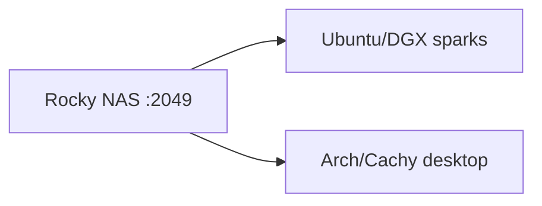

# ZFS + NFS + FS-Cache

| Field | Value |
|---|---|
| Status | Ops runbook for this cluster; pairs with [architecture.md](architecture.md) |
| Date | 2026-08-27 |

NAS (Rocky/RHEL) exports `tank/models`. Desktop (Arch/Cachy) mounts it at `/models` with `cachefilesd`. Sparks (Ubuntu/DGX) mount it at `/net/192.168.0.100/models` **without** `fsc`; `modelfs` FUSE owns `/models`. UID **1000**, mode **755**.



---

## 1. NAS (Rocky)

```bash
dnf install -y nfs-utils
systemctl enable --now nfs-server rpcbind

zfs create -o mountpoint=/export/models -o compression=lz4 \
  -o recordsize=1M -o atime=off -o xattr=sa -o relatime=off tank/models

# Linux sharenfs = exports(5) flags, not Solaris rw=host
zfs set sharenfs="rw,async,no_root_squash,no_subtree_check" tank/models
exportfs -v
showmount -e localhost

# Do not --add-service=nfs: that opens the default zone to every source
# and makes a later rich rule a no-op. Restrict NFS (and the rpcbind/
# mountd NFSv3 helpers) to the LAN.
firewall-cmd --permanent --add-rich-rule='rule family=ipv4 source address=192.168.0.0/24 service name=nfs accept'
firewall-cmd --permanent --add-rich-rule='rule family=ipv4 source address=192.168.0.0/24 service name=rpc-bind accept'
firewall-cmd --permanent --add-rich-rule='rule family=ipv4 source address=192.168.0.0/24 service name=mountd accept'
firewall-cmd --reload
```

Maintenance nothing else schedules:

```bash
systemctl enable --now zfs-scrub-monthly@tank.timer   # ships with OpenZFS >= 2.1.3
systemctl enable --now smartd                         # disks complain before they die
```

Reads of cold weight files never surface silent bit rot; scrubs do.

Snapshots, the replica, the hourly snapshot-age alarm, and the restore
drill are not optional extras of this scrub: they are [recovery.md](recovery.md)
section 3, installed from `scripts/nas/` via `scripts/install_nas_backup.sh`.
Until those timers are enabled, a deleted or overwritten weight is gone.
Scrub and smartd do not replace them.

`*` on `showmount` is world-writable as root. The firewall rich rules are
what actually limits NFS to `192.168.0.0/24` (`--add-service=nfs` would
open the default zone globally and ignore the source filter). Or
`sharenfs=off` and `/etc/exports`:

```
/export/models  192.168.0.0/24(rw,async,no_root_squash,no_subtree_check)
```

`ss -lntp | grep 2049` on the client-facing NIC. SELinux `EACCES`: `setsebool -P nfs_export_all_rw 1`. `dedup=off`. LoRAs share one base; copies use `cp --reflink=auto`.

---

## 2. Clients

### Desktop (Arch/Cachy): NFS at `/models` + cachefilesd

```bash
pacman -S nfs-utils
paru -S cachefilesd
modprobe cachefiles
systemctl enable --now nfs-client.target cachefilesd
```

```
# /etc/fstab
192.168.0.100:/export/models  /models  nfs  vers=4.2,nconnect=8,rsize=1048576,wsize=1048576,soft,timeo=30,retrans=2,noatime,nosharecache,fsc,_netdev,nofail,x-systemd.automount,x-systemd.mount-timeout=15  0  0
```

### Sparks (Ubuntu/DGX): NFS origin, no fsc

`modelfs` replaces cachefilesd. Origin must not use `fsc`.

```bash
apt-get install -y nfs-common fuse3
```

```
# /etc/fstab
192.168.0.100:/export/models  /net/192.168.0.100/models  nfs4  vers=4.2,nconnect=8,rsize=1048576,wsize=1048576,soft,timeo=30,retrans=2,noatime,nosharecache,_netdev,nofail,x-systemd.automount,x-systemd.mount-timeout=15  0  0
```

```bash
sudo mkdir -p /net/192.168.0.100/models /models /var/cache/modelfs
sudo chown 1000:1000 /net/192.168.0.100/models /models /var/cache/modelfs
```

Then [architecture.md](architecture.md). No autofs package; `/net/...` is just a directory name.

`soft` + `nofail` + automount: boot cannot hang. `hard` waits forever. `timeo` is tenths of a second.

On the **origin** (desktop `/models` or spark `/net/.../models`), after it is mounted:

```bash
chown 1000:1000 /net/192.168.0.100/models   # or /models on desktop
chmod 755 /net/192.168.0.100/models
mkdir -p /net/192.168.0.100/models/hf/{hub,datasets,xet} \
         /net/192.168.0.100/models/gguf /net/192.168.0.100/models/lora
chown -R 1000:1000 /net/192.168.0.100/models/hf \
                   /net/192.168.0.100/models/gguf \
                   /net/192.168.0.100/models/lora
```

Download as uid 1000, not sudo. `nobody:nobody`: `echo Y > /sys/module/nfs/parameters/nfs4_disable_idmapping` (a kernel module parameter, not a sysctl; persist with `options nfs nfs4_disable_idmapping=Y` in `/etc/modprobe.d/nfs.conf`).

Desktop: `pgrep -a cachefilesd` must show a process. `findmnt /models | grep fsc`. Default `dir /var/cache/fscache`. `iflag=direct` skips FS-Cache. Cull is LRU at ~7% free.

Mount stuck: `umount -l` the mountpoint. `timeout 5 bash -c "echo >/dev/tcp/192.168.0.100/2049"` (firewall) vs `timeout 10 showmount -e 192.168.0.100`.

---

## 3. Hugging Face

```
/models/hf/hub         HF_HUB_CACHE
/models/hf/datasets    HF_DATASETS_CACHE
/models/hf/xet         HF_XET_CACHE
/models/gguf/          llama.cpp
/models/lora/          adapters
```

On sparks those paths are the FUSE `/models` (bytes from NVMe/peers/NFS). On the desktop they are the NFS mount.

Hub cache snapshot trees are symlink farms into `blobs/`. The mount does not follow a symlink at a model path (`O_NOFOLLOW` on `originPread` / `originPwrite` in src/store.zig), so engines on a spark must open regular files: `hf download ... --local-dir` (below) or llama.cpp's `LLAMA_CACHE`, not a snapshot path under `HF_HUB_CACHE`. Desktop NFS still follows links in the kernel.

Token stays in `$HOME`. Triton / inductor / CUDA / vLLM compile caches stay local.

`/etc/profile.d/models-hf.sh` (systemd needs the same `Environment=`):

```bash
export HF_HUB_CACHE=/models/hf/hub
export HF_DATASETS_CACHE=/models/hf/datasets
export HF_XET_CACHE=/models/hf/xet
export HF_HUB_ENABLE_HF_TRANSFER=1
export LLAMA_CACHE=/models/gguf
export TRITON_CACHE_DIR="${XDG_CACHE_HOME:-$HOME/.cache}/triton"
export TORCHINDUCTOR_CACHE_DIR="${XDG_CACHE_HOME:-$HOME/.cache}/torchinductor"
```

Do **not** set `XDG_CACHE_HOME=/models`; that dumps pip and browsers onto NFS. llama.cpp `-hf` uses **`LLAMA_CACHE`**, not `HF_HUB_CACHE` (default is `~/.cache/llama.cpp`).

```bash
source /etc/profile.d/models-hf.sh

# llama.cpp: download into LLAMA_CACHE then run
llama-cli -hf bartowski/Llama-3.2-3B-Instruct-GGUF:Q8_0
llama-server -hf bartowski/Llama-3.2-3B-Instruct-GGUF:Q8_0
llama-server --cache-list    # what is already in LLAMA_CACHE

# or a normal file (also via hf)
hf download bartowski/Llama-3.2-3B-Instruct-GGUF --include '*Q8_0*.gguf' --local-dir /models/gguf/llama-3.2-3b
llama-server -m /models/gguf/llama-3.2-3b/*.Q8_0.gguf

# spark FUSE will not follow hub-cache snapshot symlinks; --local-dir writes regular files
hf download meta-llama/Meta-Llama-3-70B-Instruct --local-dir /models/hf/Meta-Llama-3-70B-Instruct
vllm serve /models/hf/Meta-Llama-3-70B-Instruct
```

One node downloads a repo at a time. Docker/enroot: `-e` those vars, bind `/models`.

---

## 4. Failures

| Symptom | Cause |
|---|---|
| boot hang | missing `nofail`/`automount`, or `hard` |
| `active (exited)` cachefilesd | Ubuntu `RUN=no` |
| every read hits NAS | no `fsc` or daemon dead |
| cannot write | not uid 1000, or sudo-created files |
| `nobody:nobody` | idmap; disable nfs4 idmapping |
| NAS down | `soft` → `EIO`; automount waits ≤15s |
| `serve_verify_fail` climbing | cached pieces failing their blake3 digest (bit rot, hole zeros, local tamper); see Integrity runbook below |
| `fill_err_verify` climbing | peer fills rejected by digest verification (a hostile or corrupt peer, or a stale manifest after a same-size rewrite) |

Deleted or corrupted models, a dead pool, a dead NAS: [recovery.md](recovery.md) owns backups and restores.

### Integrity runbook

`modelfs` verifies pieces twice: **at admit** (a peer fill must match the
trusted digest from the origin manifest, an origin fill, or this node's own
write -- mismatches are discarded and refilled from origin, counted in
`fill_err_verify`) and **before every `/data` or `/stage` serve** (cached
bytes are rehashed; a mismatch is refused with 500, counted in
`serve_verify_fail`, and the piece's mark is **healed** -- cleared so the
next fill re-hydrates from origin instead of failing forever).

When `serve_verify_fail` moves on the tick line:

1. Expect the refusal: the fetching peer(s) fell through to another path or
   the origin, so a serve failure is a visibility event, not a fleet outage.
2. The serving node already healed the marked pieces (a subsequent serve of
   the same piece re-hydrates and re-verifies from origin). If the counter
   keeps climbing, the corruption is ongoing (failing disk, or a hostile
   local writer): run `modelfs verify <rel> --origin <origin>` for the
   affected files to audit the whole cache and clear every mismatched mark
   in one pass.
3. Local reads are not verified per-read (only peer serves are), so a piece
   that is corrupt but never served to a peer is not auto-detected: cron
   `modelfs verify` for the files that matter, or after any disk event.

`fill_err_verify` is the fleet's view of a hostile or broken peer (or a
stale manifest after a same-size rewrite, which origin fills converge).
It is a count, not a log flood; investigate when it climbs.

Dedup decisions are measured, not guessed: `modelfs dupes <rel>... --origin
<origin>` compares piece-hash manifests and reports aligned/shared/shifted
overlap, and `modelfs dupes --all --origin <origin>` scans the whole
manifest store for byte-identical and digest-sharing pairs. Run either
before deciding whether duplicate models cost disk worth engineering for
(design.md section 14).

Durability caveat kept as-is on purpose: `sharenfs="rw,async"` lets the NAS acknowledge writes before stable storage (bounded by the txg interval), so a crash can lose writes clients saw succeed; the `soft` client mounts turn NAS trouble into `EIO` after 2 retrans instead of hanging. Synced exports would trade ingest throughput for that window; not changed here.
